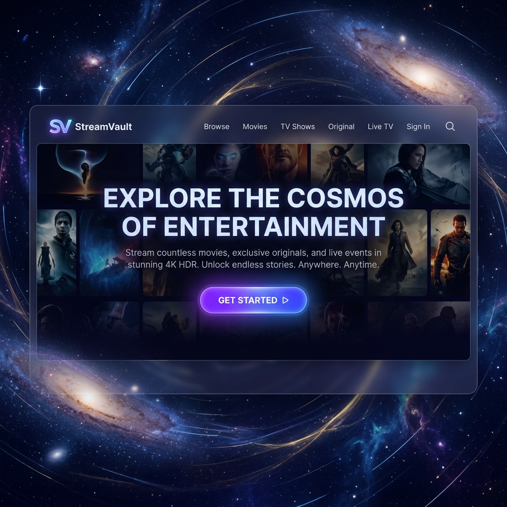
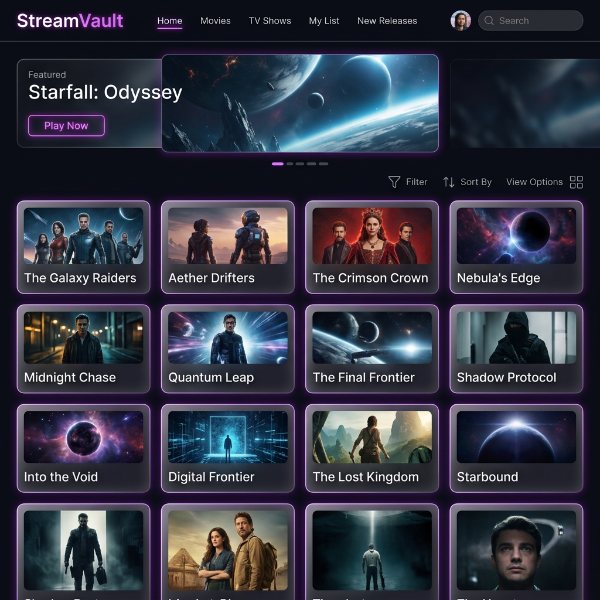
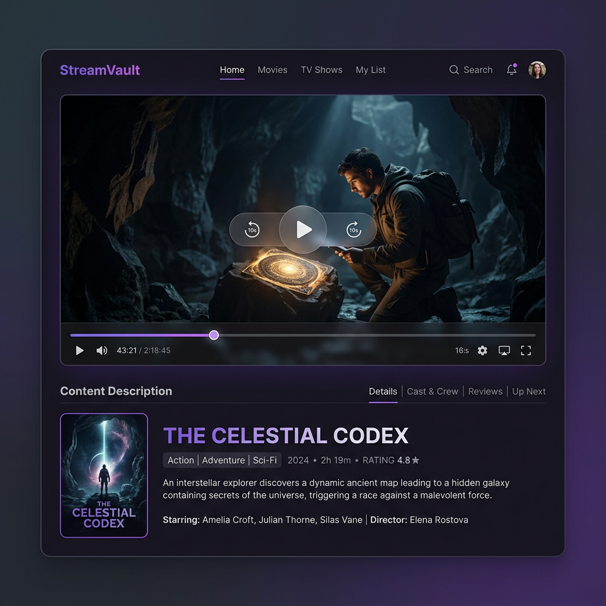

# 🌌 StreamVault

StreamVault is a high-performance, full-stack video streaming platform featuring a premium **Glassmorphism UI** and a robust **Spring Boot** backend. Designed for seamless video management and high-quality playback.

---

## 📸 Screenshots

| Landing Page | Dashboard |
| :---: | :---: |
|  |  |

| Video Player |
| :---: |
|  |

---

## 🚀 Key Features

### 🔐 Secure Authentication
- **JWT-based Security**: Stateless authentication with encrypted tokens.
- **Protected Routes**: Secure dashboard and player access.
- **Session Persistence**: Automatic login using stored tokens.

### 🎥 Video Management
- **High-Speed Uploads**: Dedicated multipart handling for large video files.
- **Upload Progress**: Real-time progress indicators for better UX.
- **Metadata Storage**: Precise tracking of video titles, sizes, and formats.

### 📺 Immersive Streaming
- **Native Player**: Custom-built video player page.
- **Partial Content Support**: Range-based streaming (HTTP 206) for efficient scrubbing and playback.
- **Format Support**: Supports standard video containers (MP4, WebM, etc.).

### 💎 Premium UI/UX
- **Glassmorphism Design**: Modern, semi-transparent frosted glass aesthetics.
- **Dynamic Animations**: Smooth transitions and fade-in effects across all pages.
- **Responsive Layout**: Optimized for desktop, tablet, and mobile viewing.

---

## 🛠 Tech Stack

### Frontend
- **Framework**: Angular (Standalone Components)
- **Styling**: SCSS with custom design tokens (Glassmorphism)
- **State Management**: RxJS Subjects & Observables
- **Testing**: Vitest + AnalogJS + Angular Testing Library

### Backend
- **Framework**: Spring Boot 3.4
- **Security**: Spring Security + JWT
- **Database**: H2 (In-memory for development)
- **Persistence**: Spring Data JPA / Hibernate
- **Testing**: JUnit 5 + Mockito + MockMvc

---

## 🏛 Architecture & API

### System Overview
```
[ Angular Frontend ] <--> [ Spring Boot API ] <--> [ H2 Database ]
                                     |
                                     v
                            [ Local File System ]
```

### API Endpoints

#### Authentication (`/api/auth`)
- `POST /signup`: Create a new account.
- `POST /login`: Generate JWT token.
- `GET /me`: Retrieve current user context.

#### Video Management (`/api/videos`)
- `POST /upload`: Upload a video (Multipart).
- `GET /`: List all videos for the authenticated user.
- `DELETE /{id}`: Remove a video file and its metadata.
- `GET /stream/{id}`: Byte-range streaming endpoint.

---

## 🚦 Getting Started

### Prerequisites
- **Node.js**: v18+
- **Java**: JDK 17+
- **Maven**: 3.8+

### Quick Start

1.  **Clone the Repo**
    ```bash
    git clone https://github.com/dexterrxx31/streamvault.git
    cd streamvault
    ```

2.  **Launch Backend**
    ```bash
    cd backend
    ./mvnw spring-boot:run
    ```

3.  **Launch Frontend**
    ```bash
    cd ../frontend
    npm install
    npm start
    ```

---

## 🧪 Testing Strategy

The project maintains high code quality through rigorous testing in both tiers.

- **Frontend (Vitest)**:
  - Unit tests for all Services (Auth, Video).
  - Component tests covering UI logic and event emissions.
  - Integration tests for routing and guard behavior.
  - Run with: `npm test`

- **Backend (JUnit/Mockito)**:
  - Controller tests (MockMvc) for API contract validation.
  - Service layer unit tests with deep mocking.
  - Form/DTO validation tests.
  - Run with: `./mvnw test`

---

## 🎨 Design Philosophy
StreamVault prioritizes **Performance** and **Aesthetics**. The UI uses a minimalist dark theme combined with vibrant accent colors and Gaussian blur effects to create a "premium" feel that sets it apart from standard streaming applications.

---

## 🛣 Future Roadmap
- [ ] AWS S3 Integration for scalable storage.
- [ ] Video transcoding using FFmpeg for multi-resolution support.
- [ ] User profile customization and avatars.
- [ ] Global search and category tags.

---

Developed by **Antigravity AI**. 🚀
