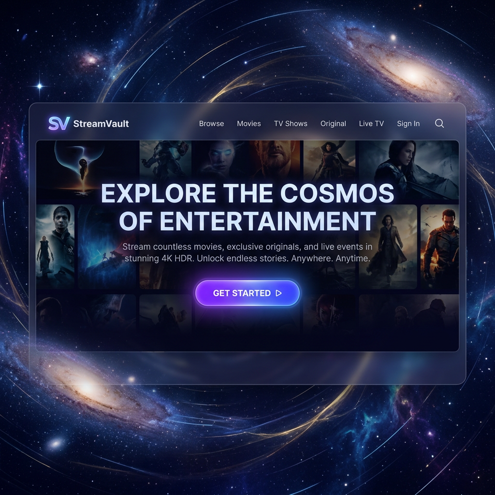
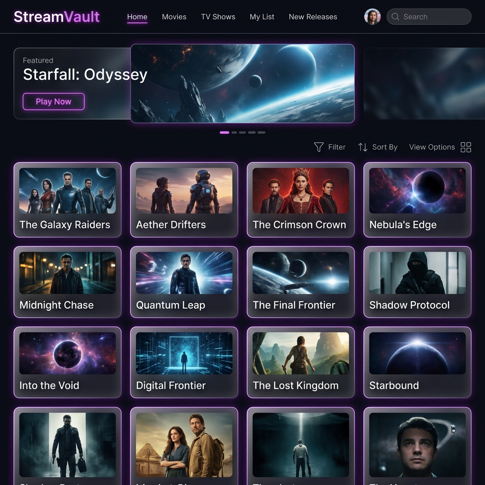
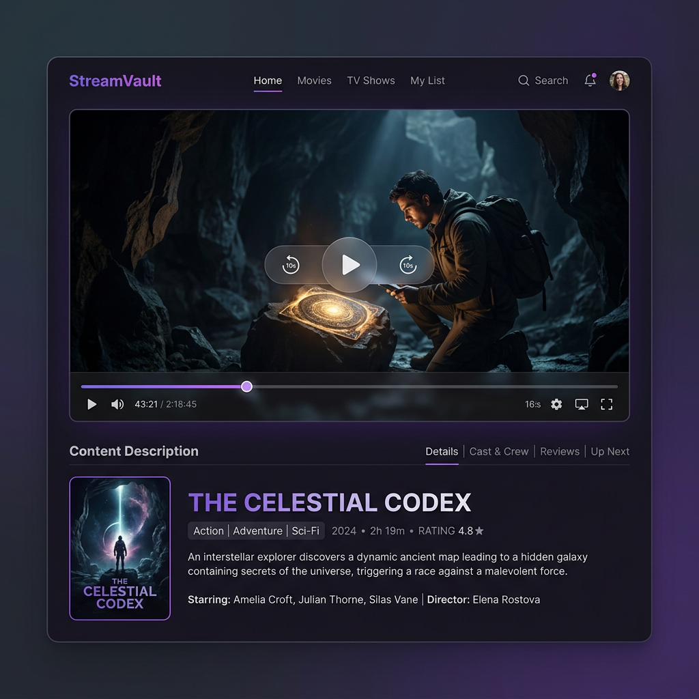

# 🌌 StreamVault

StreamVault is a high-performance, full-stack video streaming platform featuring a premium **Glassmorphism UI** and a robust **Spring Boot** backend. Designed for seamless video management and high-quality playback.

---

## 📸 Screenshots

| Landing Page | Dashboard |
| :---: | :---: |
|  |  |

| Video Player |
| :---: |
|  |

---

## 🚀 Key Features

### 🔐 Secure Authentication
- **JWT-based Security**: Stateless authentication with signed tokens; secrets come from the environment, never the repo.
- **Signed Media URLs**: Stream, thumbnail, and caption URLs are short-lived HMAC-signed links issued only to the video's owner.
- **Hardening**: Server-side input validation, login rate limiting, an upload type allowlist, and sandboxed FFmpeg input (file protocol only, container allowlist).
- **Protected Routes**: Secure dashboard and player access.
- **Session Persistence**: Automatic login using stored tokens.

### 🎥 Video Management
- **High-Speed Uploads**: Dedicated multipart handling for large video files.
- **Upload Progress**: Real-time progress indicators for better UX.
- **Metadata Storage**: Precise tracking of video titles, sizes, and formats.

### 📺 Immersive Streaming
- **Native Player**: Custom-built video player page.
- **Partial Content Support**: Range-based streaming (HTTP 206) for efficient scrubbing and playback.
- **Format Support**: Supports standard video containers (MP4, WebM, etc.).

### 💎 Premium UI/UX
- **Glassmorphism Design**: Modern, semi-transparent frosted glass aesthetics.
- **Dynamic Animations**: Smooth transitions and fade-in effects across all pages.
- **Responsive Layout**: Optimized for desktop, tablet, and mobile viewing.

---

## 🛠 Tech Stack

### Frontend
- **Framework**: Angular (Standalone Components)
- **Styling**: SCSS with custom design tokens (Glassmorphism)
- **State Management**: RxJS Subjects & Observables
- **Testing**: Vitest + AnalogJS + Angular Testing Library

### Backend
- **Framework**: Spring Boot 3.4
- **Security**: Spring Security + JWT
- **Database**: PostgreSQL (Docker) with Flyway migrations; H2 for tests
- **Persistence**: Spring Data JPA / Hibernate
- **Testing**: JUnit 5 + Mockito + MockMvc

---

## 🏛 Architecture & API

### System Overview
```
[ Angular Frontend ] <--> [ Spring Boot API ] <--> [ PostgreSQL ]
                                     |
                                     v
                            [ Local File System ]
```

### API Endpoints

#### Authentication (`/api/auth`)
- `POST /signup`: Create a new account.
- `POST /login`: Generate JWT token.
- `GET /me`: Retrieve current user context.

#### Video Management (`/api/videos`)
- `POST /upload`: Upload a video (Multipart). Kicks off async processing (metadata + thumbnails).
- `GET /`: List all videos for the authenticated user.
- `GET /{id}`: Fetch a single video's metadata (owner only).
- `PUT /{id}`: Update title, description, and tags (owner only).
- `DELETE /{id}`: Remove a video file, its thumbnail/frames, and metadata.
- `GET /stream/{id}?exp=&sig=`: Byte-range streaming endpoint (memory-efficient `ResourceRegion`).
- `GET /{id}/thumbnail?exp=&sig=`: Auto-generated poster thumbnail.
- `GET /{id}/captions.vtt?exp=&sig=`: WebVTT captions from Whisper transcription.

The three media endpoints need no JWT (`<video>`, `` and `<track>` tags can't send one). Instead they require the pre-signed `streamUrl` / `thumbnailUrl` / `captionsUrl` returned in the owner's video metadata. Unsigned, forged, or expired requests get a 404.

---

## 🚦 Getting Started

### Prerequisites
- **Node.js**: v18+
- **Java**: JDK 17+
- **Maven**: 3.8+
- **FFmpeg**: `ffmpeg` + `ffprobe` on PATH (`brew install ffmpeg`) — used for video metadata and thumbnail generation. If missing, uploads still work but are marked `FAILED` after processing.
- **Docker**: for the PostgreSQL database (`docker compose up -d`). Data persists across restarts in a named volume.

### Optional (AI features)
- **Claude API key**: set `ANTHROPIC_API_KEY` to enable AI-suggested titles/descriptions/tags (from video frames) and AI chapters/summaries (from the transcript). Without it, videos process normally — the AI steps are skipped.
- **whisper.cpp**: `brew install whisper-cpp`, download a model (e.g. [ggml-base.en.bin](https://huggingface.co/ggerganov/whisper.cpp/resolve/main/ggml-base.en.bin)), and set `WHISPER_MODEL_PATH=/path/to/ggml-base.en.bin` to enable transcription + closed captions. Transcription runs on CPU and queues behind other processing for long videos.

### Quick Start

1.  **Clone the Repo**
    ```bash
    git clone https://github.com/dexterrxx31/streamvault.git
    cd streamvault
    ```

2.  **Set secrets** (required; the backend refuses to start without them)
    ```bash
    export JWT_SECRET="$(openssl rand -base64 48)"
    export MEDIA_SECRET="$(openssl rand -base64 48)"
    # optional; defaults to "streamvault" for local dev
    export DB_PASSWORD=streamvault
    ```
    See `.env.example`. Keep the values stable across restarts, or existing logins and media links become invalid.

3.  **Start PostgreSQL** (bound to localhost only)
    ```bash
    docker compose up -d
    ```

4.  **Launch Backend**
    ```bash
    cd backend
    ./mvnw spring-boot:run
    ```

5.  **Launch Frontend**
    ```bash
    cd ../frontend
    npm install
    npm start
    ```

---

## 🧪 Testing Strategy

The project maintains high code quality through rigorous testing in both tiers.

- **Frontend (Vitest)**:
  - Unit tests for all Services (Auth, Video).
  - Component tests covering UI logic and event emissions.
  - Integration tests for routing and guard behavior.
  - Run with: `npm test`

- **Backend (JUnit/Mockito)**:
  - Controller tests (MockMvc) for API contract validation.
  - Service layer unit tests with deep mocking.
  - Form/DTO validation tests.
  - Run with: `./mvnw test`

---

## 🔄 CI & Dependency Updates

- **CI** (`.github/workflows/ci.yml`): every push and pull request to `main` builds and tests the backend (JDK 23, Maven) and the frontend (Node 22: `npm test`, then `npm run build`).
- **Dependabot** (`.github/dependabot.yml`) opens update PRs every Monday for:

  | Ecosystem | Location | Grouped updates |
  | :--- | :--- | :--- |
  | Maven | `backend/` | Spring Boot, jjwt, Flyway |
  | npm | `frontend/` | Angular packages, test tooling (Vitest, AnalogJS, jsdom) |
  | GitHub Actions | `.github/workflows/` | all actions |
  | Docker Compose | `docker-compose.yml` | Postgres image |

  Major upgrades of Spring Boot, Angular, and Postgres are ignored on purpose. They need a deliberate migration (`ng update`, `pg_upgrade`), not a version bump. Every Dependabot PR runs through CI like any other change.
- **Security updates**: enable *Settings → Code security → Dependabot security updates* on GitHub to get immediate PRs for vulnerable dependencies, in addition to the weekly schedule.

---

## 🎨 Design Philosophy
StreamVault prioritizes **Performance** and **Aesthetics**. The UI uses a minimalist dark theme combined with vibrant accent colors and Gaussian blur effects to create a "premium" feel that sets it apart from standard streaming applications.

---

## 🛣 Future Roadmap
- [ ] AWS S3 Integration for scalable storage.
- [ ] Video transcoding using FFmpeg for multi-resolution support.
- [ ] User profile customization and avatars.
- [ ] Global search and category tags.

---

Developed by **Antigravity AI**. 🚀
